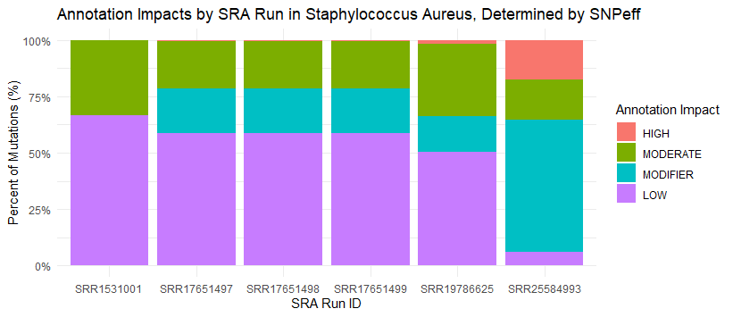
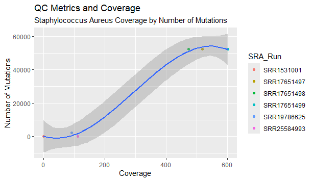

  
  

<h1>Mutation Rate Meta-Analysis of Human Pathogenic Bacteria</h1>

<h2>Introduction</h2>
  
Understanding genetic variations and their impacts is crucial in studying microbial evolution and antibiotic resistance. Deletions, missense mutation, and other types of mutations create variants, which result in differing degrees of protein alteration and play a significant role in the adaptability and survival of bacteria. Visualizing these mutations using circus plots and stacked bar plots allows researchers to identify patterns and trends across different strains. By integrating these visualizations with the theory of neutral evolution, which favors advantageous mutations that are more likely to persist, we can better comprehend the dynamics of bacterial evolution for antibiotic resistance in their genome. This project aims to process vast genomic datasets of <em>Staphylococcus aureus</em> and <em>Pseudomonas aeruginosa</em> to automate variant analysis and ultimately create a comprehensive database to enhance our understanding of genomic mutations and  inform possible further genome studies against antibiotic resistance.

<h2>Data</h2>
  
 The Variant Calling Format (VCF) was obtained from the National Center for Biotechnology Information (NCBI) Sequence Read Archives. 
  The files retrieved were in FASTQ format, a widely used text-based format containing raw data of biological sequences. This format is 
  essential as it includes the nucleotide sequence and its corresponding quality score (the accuracy of each nucleotide in a biological sequence).
  

<h2>Code</h2>

[Concatenate CSV.R](https://github.com/PhyloGrok/VCFplots/blob/main/code/Concatenate_CSVs.R)

Summary: Merges all the annotated CSVs together into one .csv file.

- It utilizes dplr, readr, andd ggplot2 packages. In the code it retrieves the working directory and imports all the csv files of each SRA Run. These files are read into a list and merged into a single data frame with "bind_rows". 

[Annotation Impact Bar Plot.R](https://github.com/PhyloGrok/VCFplots/blob/main/code/Annotation_Impacts_BarPlot.R)

Summary: Visualizes each SRA Run mutation impact with the use of R.

- It utilizes dplr, readr, and ggplot2 packages. Reading eacg independent SRA run csv file to filter out rows with missing values in Annotation impact and counts each occurence of each Annotation Impact for the SRA Run. The code then arranged the graph based on "low" impact in descending order creating a stacked bar plot.

[QC plot_SA.R](https://github.com/PhyloGrok/VCFplots/blob/main/code/QC_Plot_SA.R)

Summary: Visualize viable strains for the experiment considering genomic range to the reference genome of the respective bacterium.

-  It utilizes tidyverse, ggthemes, and ggplot2 packages. The script then reads the CSV file into a data frame and uses ggplot2 to create a scatter plot of the data, mapping Coverage to the x-axis and Count._of._SRA_Run to the y-axis, with points colored by the SRA_Run variable. It adds a polynomial regression line of degree 3.5 to the plot.

[Qxygen and Temperature](https://github.com/PhyloGrok/VCFplots/blob/main/code/Oxy_Temp.R.qmd)

Summary: Visualize the count of temperaure and oxygen requirement.

- It utilizes tidyverse and dplr. The script reads the CSV file where it added "missing" to all the missing values. Seperated Oxygen into a different dataset and did the same for temperature. Then using ggplot2 to make the chart. 

[Freq_of_CheckM](https://github.com/PhyloGrok/VCFplots/blob/main/code/Freq_of_CheckM.R)

Summary: Visualizes the top 15 most frequent CheckM marker sets

- It uses ggplot and dplr to read the csv script, and then prodced to use the CheckM.marker.set column. It counted the frequency/mention of each type, then only using the top 15 created a bar plot that potrays the top 15 most frequent CheckM sets and how much of them there are.

[Annotation_Count](https://github.com/PhyloGrok/VCFplots/blob/main/code/Annotation_Count.R)

Summary: Visualizes the top 10 most frequent CheckM marker sets with regard to comparing pseudogenes and protien-coding

- It uses ggplot and dplt to read and visualize the csv file. Importing the file, it counts the frequency of CheckMs, using it as a coloring scheme for the scatter plot which depict the rate of Annotated Count Gene Protien-coding for pseudogene.

[Combined Plots](https://github.com/PhyloGrok/VCFplots/blob/main/code/Combined_Plot.R)

 Summary: Combined visual of the ChecmM marker sets, scatter, density, bar plot

- The code imports necessary packages like tidyverse and ggplot2 to analyze and visualize genomic data by reading CSV files, filtering the top 4 most frequent CheckM marker sets, summarizing their average gene counts, and creating multiple visualizations including a scatter plot for protein-coding genes and pseudogenes, a density plot, a bar plot with shortened marker names, and a summary table, all combined into a clean 2x2 layout.

<h2>Plots</h2>

<h3> <em> Pseudomonas aeruginosa </em> </h3>

<h3> <em>Staphylococcus aureus </em> </h3>
 

<h2>Results</h2>
<h3> <em> Pseudomonas aeruginosa </em> </h3>

The plot visualized in the Annotation Impact plot reveals that the generally more modifier and low mutation impacts being seen in each SRA Run.

<h3> <em>Staphylococcus aureus </em> </h3>

The Annotation Impact plot provides a visualization of the overall distribution of mutation impacts the SRA Run, highlighting a trend where most mutations occur. There is a prevalent trend in the modifier and low effect, showing a more minor influence on the genetic sequence.

<h2>Acknowledgements</h2>
UMBC Translational Life Science Technology (TLST) student interns Nhi Luu, Aimee Icaza, and Ketsia Pierrelus are supported by Merck Data Science Fellowship for Observational Research Program and the UMBC College of Natural and Mathematical Sciences.  Nhi Luu developed the annotation scripts, R-Shiny framework and integration, also provided refrece scripts to be edited. Alazer Manakelew volunteered as a senior at Springbrook High School, contributing code and debugging scripts. 
